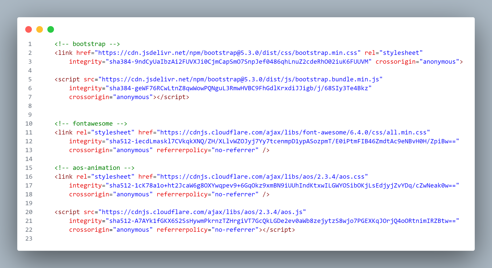

# wedding photography 🎉
We have collected the best photographers in this website for you to have special photos & videos in wedding day..
## Key Topics

**language**
+ HTML
  + Semantic elements, tags
  + Attributes
  + Best practices: indentation, file naming conventions and directory structure
    
 ```html
<div class="cta">
        <div class="cta__txt">
            <h2>Golden Moment Wedding Photography & Film</h2>
            <h3>ARE YOU READY TO EXPERIENCE <br> YOUR SPECIAL DAY WITH US?</h3>
            <a href="./contact.html">Contact With Us</a>
        </div>
    </div>
 ```
+ CSS
  +  Class vs. id
  +  Selectors
  +  Box model
  +  Positioning
  +  Color: hexadecimal, rgb and named
  +  Flexbox

+ SAAS
  + Variables
  + Nesting
  + Partials
  + import
  + Mixins
    
```sass
$primary-color: black;
$primary-color2: white;
$form-color:red;
```

```css
.nav {
        &__a {
            a {
                margin: $s-margin;
                font-size: larger;
                font-family: afont;
            }
        }
    }
```

```sass
@import 'abstracts/variables';
@import 'abstracts/base';
@import 'abstracts/mixins';
```

```sass
@mixin flexBox($justify-content , $align-items , $direction) {
    display: flex;
    justify-content: $justify-content;
    align-items: $align-items;
    flex-direction: $direction;
}
```
4. js
  + Change design for navbar with scroll
  + Show menu on mobile viewport

```js
    <script>
        window.onscroll = function () { scrollFunction() };
        let ScrollDesign = document.querySelector(".nav");

        function scrollFunction() {
            if (window.pageYOffset > 100) {
                ScrollDesign.classList.add("navbar");
            } else {
                ScrollDesign.classList.remove("navbar");
            }
        }
    </script>
```


**libraries**
+ Bootstrap
  + Carousel for slide section in index.html
 
+ Aos-animation
+ Fontawesome


